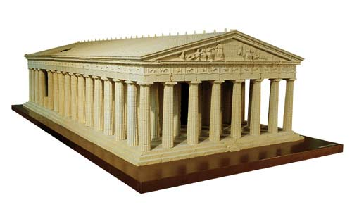

# 26 marzo 2018

* Settaggio github e alcune correzioni al codice iniziale; si decide di menzionare la sostituzione di un file nella cartella "lib" dovuto ad un mancato aggiornamento.

* DECISIONE: Verrà data priorità alla costruzione della parte statica del progetto e solo a terminazione avventuta ed in base alla scena creata si deciderà se introdurre un terreno piuttosto che un video multimediale per animare la scena.

* Ricerca di una possibile immagine statica da riprodurre. Abbiamo considerato più alternative e di seguito verranno menzionate quelle che abbiamo maggiormente articolato:

* Idea della creazione di un castello a pianta quadrata: pianta base con torrette. Dopo una riflessione viene scartata, difficoltà nel trovare valide ani 

Provo ad aggiungere una foto adesso:  
funziona?

* Discussione relativa all'uso della possibilità di usare oppure fare a meno delle texture. Si è deiciso di utlizzare il documento 

divisione del codice 

file principale in main.html 