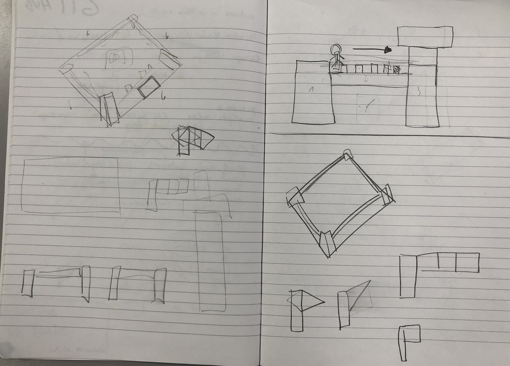

 <h1>Journal Tissi-Filippi</h1> 

# 26 marzo 2019

* Settaggio github e alcune correzioni al codice iniziale; si decide di menzionare la sostituzione di un file ("OrbitControls.js") nella cartella "lib" dovuto ad un mancato aggiornamento.

* DECISIONE: Verrà data priorità alla costruzione della parte statica del progetto e, solo a terminazione avvenuta della stessa ed in base alla scena creata, si deciderà in modo definitivo se introdurre un terreno piuttosto che un video multimediale per animare la scena. 

* Ricerca di una possibile immagine statica da riprodurre. Abbiamo considerato più alternative e di seguito verranno menzionate quelle che abbiamo maggiormente sviluppato:

    * Idea del castello. Consiste nella creazione di un castello a pianta quadrata, in ogni faccia si troveranno delle piccole torri disposte ad angolo tra di loro. Successivamente verranno aggiunti dei personaggi con la capacità di movimento (traslazione), come proposto nella figura sottostante. Inoltre, abbiamo discusso della possibilità di introdurre alcune bandiere posizionate agli estremi del castello e di animarle come se venissero investite dal vento. Nell'immagine sono presenti due diversi tipi di bandiera, una più semplice e una più complessa ed articolata.
    Nella figura si presentano alcuni sketch che abbiamo realizzato a matita.  

    * Idea del tempio. Consiste nella creazione di una base a pianta quadrata; per creare l'effetto scalini o “gradinata" si è deciso di inserire tre quadrati che verranno sovrapposti ed opportunamente scalati. 
    La pianta del tempio sarà rettangolare, con le colonne ai lati; sul lato maggiore verranno inserite 6 colonne, mentre quello minore consterà di 3 colonne. Poiché le colonne sono disposte ad angolo la pianta che si formerà dovrebbe avere l'aspetto presentato nella parte a destra della figura sottostante la descrizione.
    La copertura del tempio consisterà in un rettangolo della stessa dimensione dell'ultimo che è stato inserito come scalino. Non si è ancora deciso con certezza cosa verrà inserito al di sopra, si pensava di realizzare due piramidi: per realizzare le facce di ciascuna delle piramidi si pensava di inserire dei quadrati che seguivano le diagonali del rettangolo che dovrebbero formare. Una volta completata tale fase si procederà con una rotazione delle stesse che andranno a formare la piramide. La parte rimanente del tetto potrebbe venire lasciata libera oppure potrebbero essere inserite delle bandiere, progettate in modo simile a quanto descritto nell'idea del castello.
    Per quanto riguarda la parte di movimento della scena si pensava di introdurre due personaggi che si muoveranno in maniera opposta ai lati più lunghi del tempio. Ogni personaggio potrebbe venire rappresentato come è evidente nella parte sinistra della foto sottostante. Nel cielo si è pensato di introdurre delle nubi che verranno riprodotte usando dei cubi bianchi.
    Nella figura si presentano alcuni sketch che abbiamo realizzato a matita.  

* DECISIONE: si è preferita l'alternativa del tempio poiché ritenuta più adeguata e che permette una miglior gestione delle animazioni. Inoltre, si è pensato all'introduzione di un muretto che circonda il tempio e che poggia nel gradone più basso.

* Divisione del codice e strutturazione diversa delle cartelle.

# 27 marzo 2019

* Revisione del Journal trascritto la giornata precedente.

* DECISIONE: costruzione dei gradoni utilizzando 3 cubi opportunamente modellati, le distanze e la dimensione dei cubi saranno evidenziate in seguito. 

* Dopo aver costruito il basamento si è proseguito con la costruzione del muro.

* DECISIONE: tutti i muri sono stati accorciati di 5 da entrambi i lati per permettere l'inserimento delle 4 torrette laterali.

* Discussione sulla grandezza di una singola colonna e suo inserimento nel progetto (spazio occupato e valutazione dello spazio disponibile)

* DECISIONE: riprogettazione dello spazio e conseguente riallineamento dei cubi che compongono la scena. Introduzione di variabili il più possibili modificabili e creazione del seguente sketch per la futura organizzazione della scena.  

* Osservando la figura precedentemente inserita è possibile osservare anche le misure che sono state decise per la creazione di ogni colonna. Ogni colonna è stata costruita con 4 cubi modellati e inseriti uno sopra all'altro.

* DECISIONE: Si riporta il grafico per che tiene conto dei pivot che sono stati inseriti nella scena  

* Raffinatura del codice

* Allineamento dei pezzi che compongono la colonna per poterne visualizzare una completa nella scena. 

* Discussione se questa mossa sia stata benefica oppure no poiché gli altri pezzi erano stati generati e poi ruotati, traslati dalla posizione iniziale. DECISIONE: in questo caso si è deciso di costruire una colonna della stessa altezza nell'asse y, così domani basterà solo posizionarle nella posizione corretta seguendo lo schema definito sopra.

* Osservazioni relative alla possibilità di introdurre fin da subito alcune texture (almeno per differenziare all'occhio le colonne) e non fare tutto il lavoro alla fine.

# 28 marzo 2019

* Revisione del Journal trascritto la giornata precedente.

* Disposizione delle colonne nel progetto seguendo lo schema predisposto il giorno prima.

* Scrittura del codice della classe "Roof.js" che conterrà il tetto della struttura.

* Problema inaspettato nell'osservazione del progetto originale del tetto una volta realizzato. Viene inserita l'immagine.  

* DECISIONE: Il tetto non è gradevole all'occhio e rende la struttura pesante. Soluzione: eliminazione e riprogettazione.

* La modifica del tetto ha causato la modifica strutturale da parte del progetto delle colonne. Codice che era stato scritto era mutevole senza grandi problemi dunque questo imprevisto non ha portato via molto tempo. 

* Modifica della colonna effettuata. Collocazione delle colonne nel progetto indipendenti dalla struttura delle stesse.

* DECISIONE: Inserire nel fronte e nella faccia back del tempio una piramide vista frontalmente, come se fosse il frontone di un tempio classico. 

* DECISIONE: Verrà inserito un ulteriore personaggio nel mezzo del tempio e per permettere la visione libera si decide di non introdurre una trave che potrebbe coprire la scena e non renderla ben visibile.

* Conclusione della mattinata con una breve discussione sulle texture che si potrebbero applicare alla scena.

* DECISIONE: Entro venerdì sera bisogna costruire tutti i personaggi e posizionarli nel progetto.

* DECISIONE: Discussione e rappresentazione del personaggio.

* Progettazione nel dettaglio delle dimensioni del personaggio prima di introdurlo nella scena. In un primo tempo si era deciso di attribuirgli un'altezza totale di 30 cm, poi è stata ridotta. 

* Costruzione del personaggio seguendo fedelmente il progetto con aggiunta delle adeguate texture

* DECISIONE: Alla testa sono state applicate delle texture con un array. Sono 2 diverse: una tutta bianca e una con la faccia. Entrambe le immagini sono state modificate con Adobe Photoshop.

# 29 marzo 2019

* Revisione del Journal trascritto la giornata precedente.

* Modifica delle texture inserite al personaggio il giorno precedente.

* Progettazione del personaggio nuovo e sua implementazione. Non si riporta nel Journal la descrizione dettagliata del personaggio come fatto precedentemente poiché la struttura è simile e si differenzia per la posizione delle braccia.

* Inserimento e posizionamento del cubo nel mezzo del tempio e ricerca della texture adeguata. Inserimento della rotazione sull'asse x e asse y in contemporanea, inserimento inoltre di una traslazione continua sull'asse y.

* DECISIONE: Valutazione ed introduzione delle luci relative al cubo nella scena.

* Inserimento dell'animazione per i due personaggi posizionati ai lati del tempio. Lo spostamento è una semplice traslazione sull'asse z.

* DECISIONE: osservando la scena, si decide cercare di creare un movimento ondulatorio progressivo durante l'avanzamento del personaggio, movimento che ricorda di più un fantasma.
 

# 30 marzo 2019 - 31 marzo 2019

* Revisione del Journal trascritto la giornata precedente.

* Risoluzione del problema relativo all'animazione del personaggio di sinistra, all'esterno del tempio.

* DECISIONE: aggiunta delle decorazioni quadrate nel tempio. 5 si troveranno nel lato sinistro e destro mentre 3 davanti e dietro.

* Proposta di inserire due paletti all'entrata del tempio, ma l'idea è stata scartata.

* Programmazione degli obiettivi da raggiungere durante i giorni della settimana futura.

# 1 aprile 2019

* Revisione del Journal trascritto la giornata precedente.

* Pulizia del codice.

* Animazione del personaggio al centro della scena.

* DECISIONE: rimozione della luce direzionale.

* Introduzione del BoxBufferGeometry.

* DECISIONE: i personaggi all'esterno del tempio avranno in mano un'asta.

* Realizzazione dell'idea appena decisa.

** _DA SVOLGERE GLI ULTIMI GIORNI_ **
 - texture colonna
 - colore delle decorazioni
 - colore altare
 - colore del muretto, lo stesso delle colonne
 - controllare le luci

 # 2 aprile 2019

 * Revisione del Journal trascritto la giornata precedente.

 * Preparazione del file del terreno.

 * Preparazione della mappa in scala di grigi usando il programma Adobe Photoshop. Riduzione della dimensioni della mappa.

 * DECISONE: dedicare del tempo domani per controllare le texture della scena.

 # 3 aprile 2019

 * Revisione del Journal trascritto la giornata precedente. 

 * Generazione del terreno e della funzione che pratica il refill.

 * TO DO:
   - Inserire la "cornice" del nostro terreno, ossia tutti i pixel che si trovano in posizione: (0,n) gli orizzontali alti, (n,0) verticali a sinistra, (75,n) per i bassi e (n,75) per i verticali destri. [con n che va da 0 a 75] ... Ognuno di quei pixel deve avere la colonna piena fino alla base (altezza uguale alla sua altezza), cosi facendo creo un modo maggiormente gradevole all'occhio --> IDEA SCARTATA

   - gestire le texture e valutare la loro possibile introduzione per sostituire i colori RGB di cui ci si è serviti fino ora.

   - Pulizia del codice

   - Possibile rimozione della neve nelle heightmap

   - Modifica delle texture già esistenti

   - Rialzare un po' il tempio (asse y)

   - Completamento del file _README.md_

# 4 aprile 2019
  
  * Revisione Journal trascritto la giornata precedente

  * Cambio texture del terreno

  * TO DO:
    - rifinire l'immagine per la heightmap

    - rialzare il tempio

    - segnare nella relazione il nostro frame rate

    - completare il file _README.md_

    - pulire il codice e finire di commentarlo
    
    - posizionare la telecamere

    - fare gli screen

# 5 aprile 2019

  * Revisione Journal trascritto la giornata precedente
  
  * Tempio rialzato

  * Telecamera posizionata

  * Commentato tutto il codice

# 6 - 7 - 8 aprile 2019

  * Revisione totale del journal
  
  * Modifica posizione della camera

  * Conclusione file _README.md_

  * Rimozione screen e file non utilizzati
