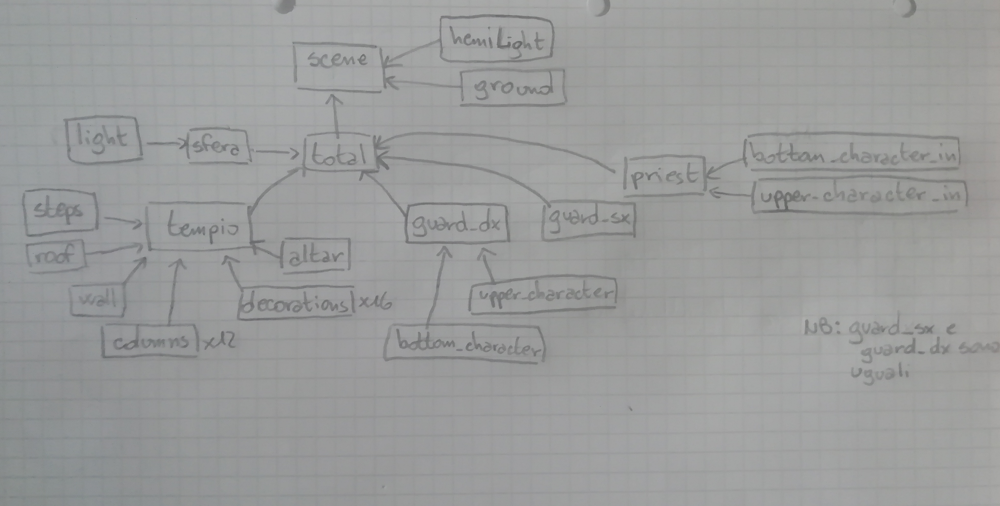
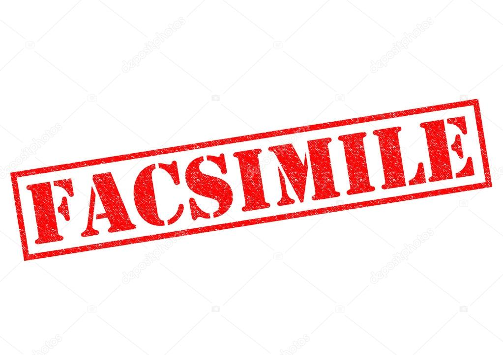

# Report Tissi-Filippi
La scena che ci siamo immaginati ha come location un zona pianeggiante con rilievi montuosi; posizionato al centro, nel piano, è situato un tempio greco ormai abbandoneto alle intemperie e al passare inesorabile del tempo. All'interno di esso si svolge la scena dove i protagonisti sono alcuni personaggi che si è scelto di rappresentare come fossero degli spiriti, quasi delle presenze. Due si trovano all'esterno e hanno lo scopo di sorvegliare il tempio. Il protagonista è al centro della scena, intento a far levitare verso l'alto il cubo, che ruota nelle varie direzioni. E' possibile modificare la luce che fuoriesce dal cubo, premendo il tasto "a".

# Presentazione della strutturazione delle cartelle

Il progetto ha avuto inizio a partire dal codice contenuto nel file _StartingCode-withlights.html_ e _StartingCode-heightmap.html_

Il processo di creazione dell'eleaborato finale aggiornato, di giorno in giorno, si trova nel file _Journal.md_
Di seguito presentiamo l'organizzazione che abbiamo scelto per le cartelle durante il progetto:

* Il codice principale si trova nel file: _index.html_
* All'interno della cartella _obj_ sono stati inseriti i file in javascript che contengono le varie classi costruite.
* Nella cartella _StartingCode_ abbiamo inserito il codice di partenza che ci è stato fornito.
* Nella cartella _scripts_ sono stati inseriti i file riguardanti le luci, il codice di getHeightData.
* Le texture usate sono state inserite nella cartella denominata _textures_, mentre la heightmap usata per la generazione del terreno è stata inserita all'interno della cartella _ground_, presente nella stessa cartella.
* La Heightmap è stata creata da noi _ah hoc_ per questo progetto adattandola al meglio per valorizzare il nostro lavoro.

# Animazioni della scena

Sono state introdotte 4 animazioni nella scena:

* Animazione ondeggiante del personaggio "guardia" sulla sinistra del tempio.

* Animazione ondeggiante del personaggio "guardia" sulla destra del tempio.

* Aniomazione della sfera: levitazione verso alto e verso il basso, inoltre rotazione asse x e y.

* Animazione del personaggio posizionato al centro della scena: movimento verso l'alto e verso il basso.

* La luce nella scena è modificabile premendo il tasto "a" della tastiera.

# Progettazione oggetti della scena

Abbiamo deciso di progettare la scena prima su carta e solo dopo un minuzioso lavoro abbiamo deciso di riportarla nel file javascript. Per completezza, anche se già presenti nel file _Journal.md_ si riportano alcune immagini della progettazione.

# Albero della scena

L'immagine che segue contiene l'albero che si è deciso di seguire per la formazione della scena.  

# Risultato finale

L'immagine che segue rappresenta, in modo statico, l'elaborato finale del nostro lavoro e il frame-rate, testato utilizzando il nostro pc (MacBook Pro), è di 35 fps.

