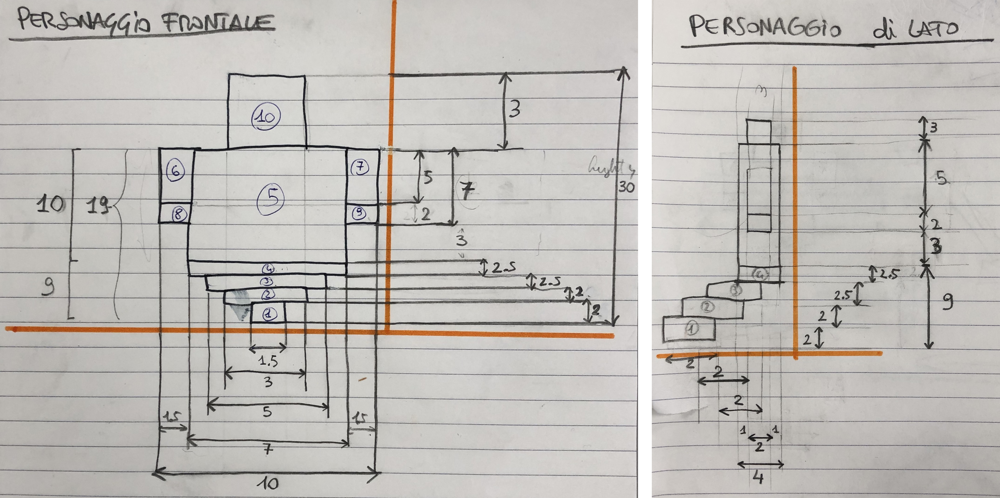

# Report Tissi-Filippi
La scena che ci siamo immaginati ha come location un zona montuosa; posizionato al centro, nel piano, è situato un tempio greco ormai abbandonato, all'interno del quale si svolge la scena che ci siamo immaginati: i protagonisti sono alcuni personaggi che si è scelto di rappresentare come degli spiriti che hanno preso possesso del tempio. Due si trovano all'esterno e hanno lo scopo di sorvegliare il sacerdote, che si trova al centro della scena, intento a compiere magie su un cubo che abbiamo immaginato come una sorta di Tesseract, ovvero un dispositivo contenente una immensa quantità di energia e in grado di trasformare in realtà ogni desiderio di chi lo detiene. E' possibile modificare la luce aggiunta al Tesseract premendo il tasto "a" della tastiera.

# Presentazione della strutturazione delle cartelle

Il progetto ha avuto inizio a partire dal codice contenuto nel file _StartingCode-withlights.html_ e _StartingCode-heightmap.html_. Il processo di creazione dell'elaborato finale aggiornato, di giorno in giorno, si trova nel file _Journal.md_. Per una migliore gestione del lavoro abbiamo deciso di servirci anche del programma _GitKraken_.

Di seguito presentiamo l'organizzazione che abbiamo scelto per le cartelle durante il progetto:

* Il codice principale si trova nel file: _index.html_
* All'interno della cartella _obj_ sono stati inseriti i file in javascript che contengono le varie classi costruite.
* Nella cartella _StartingCode_ abbiamo inserito un backup del codice di partenza che ci è stato fornito.
* Nella cartella _scripts_ sono stati inseriti i file riguardanti le luci, il codice di getHeightData e un file _main.js_ che ci siamo tenuti nel caso servisse implementare qualche funzione generale.
* Le texture usate sono state inserite nella cartella denominata _textures_, mentre l'immagine utilizzata per generare il terreno è stata inserita all'interno della cartella _ground_, presente nella stessa cartella, dove sono presenti anche varie texture sempre per il terreno.
* L'immagine che abbiamo utilizzato come Heightmap è stata creata da noi _ah hoc_ tramite Photoshop, adattandola al meglio per valorizzare il nostro lavoro. Il risultato è volutamente molto "discontinuo", questo perchè volevamo rendere una sorta di terreno pieno di rocce insidiose e poco uniformi. Inoltre, in base al valore di scala di grigi, posizioniamo il primo cubo a una determinata altezza, con sotto una pila di cubi uguali a esso.

# Animazioni della scena

Sono state introdotte 4 animazioni nella scena:

* Animazione ondeggiante del personaggio "guardia" sulla sinistra del tempio.

* Animazione ondeggiante del personaggio "guardia" sulla destra del tempio.

* Animazione del Tesseract: levitazione verso l'alto e verso il basso, inoltre rotazione sugli assi x e y.

* Animazione del personaggio posizionato al centro della scena: movimento verso l'alto e verso il basso.

* La luce aggiunta al Tesseract è modificabile premendo il tasto "a" della tastiera.

# Progettazione oggetti della scena

Abbiamo deciso di progettare la scena prima su carta e solo dopo un minuzioso lavoro abbiamo deciso di svilupparla con Three.js. Per completezza, anche se già presenti nel file _Journal.md_, si riportano alcune immagini della progettazione con relativa descrizione.

Abbiamo inizialmente progettato il nostro tempio, dando misure specifiche su dove posizionare i vari elementi, quali colonne, gradini e tetto. Inoltre, abbiamo lasciato dello spazio libero ai lati in modo da inserire dei personaggi.
Nell'immagine sottostante è anche presente una bozza della singola colonna.

 

Dopo aver implementato il tempio in Three.js, siamo passati alla progettazione dei personaggi, restando coerenti con quanto deciso precedentemente riguardo gli spazi. I personaggi sono stati divisi in due tipologie: il personaggio esterno, rappresentato con un arma in mano e con colori differenti per la parte superiore e per la parte inferiore, e il personaggio interno, tutto di un colore e di conseguenza con la parte inferiore progettata con qualche modifica.

# Albero della scena

L'immagine che segue contiene lo _SceneGraph_ che si è deciso di seguire per la formazione della scena.

 

# Risultato finale

L'immagine che segue rappresenta l'elaborato finale del nostro lavoro. Il frame-rate, testato utilizzando un MacBook Pro, è di 35 fps.

